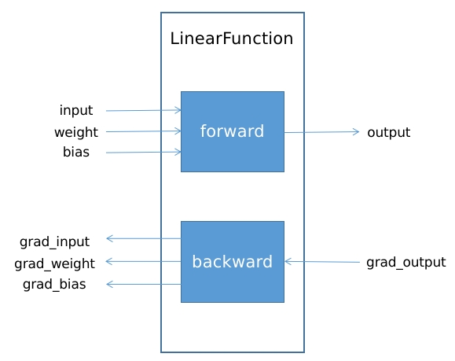

# 详解pytorch自定义算子实现及反向传播梯度推导
## 自定义算子的四个层次
本文主要参考pytorch的两篇文档，但并不是对它们的翻译，而是带有自己的理解和总结。  
https://pytorch.org/docs/stable/notes/extending.html#  
https://pytorch.org/tutorials/advanced/cpp_extension.html#  
从最终的实现结果上来看，pytorch自定义算子其实就是实现了一个继承了torch.nn.Module的类。笔者总结出四种实现方式，也是由浅到深的四个层次，如下：  
1. 对torch.nn里面多个算子的封装  
这是最简单的一种，用过pytorch应该都会知道。前向传播只需要按自己的需求依次调用torch官方提供的算子和其他操作就好。反向传播不用自己写，由自动求导机制完成  
2. 实现torch.autograd.Function的子类  
自动求导机制是通过Function类的静态方法forward和backward实现的。这种方式下，前向传播的实现有了更高的自由度，可以用pytorch、numpy或者其他其三方库提供的操作来实现。但代价是需要自己实现反向传播  
3. torch.autograd.Function子类的forward和backward核心运算代码通过cpp实现  
上面的第二种方式提到前向传播可以用第三方库实现，那可以将cpp动态库也理解为一种第三方库，这是对方式二的扩展。同时torch提供了很方便的集成和调用方式，我们可以在cpp实现中使用torch。相比与上面的方式二，使用cpp写算子带来收益前后向传播时节省了此时运行python解释器的消耗  
4. torch.autograd.Function子类的forward和backward核心运算代码通过cuda实现
这是对方式三的扩展。由于torch提供了专门的接口，能够很方便地使用cuda操作torch::Tensor的源数据  
本文主要讲解以上提到的第二三四种方式，完整的示例代码见  
## 实现torch.autograd.Function的子类
### LinearFunction示例详解
以线性函数LinearFunction的实现为例子进行讲解，先给出核心实现代码如下。通过看forward中的output = input @ weight.T + bias[None, ...]可以看出就是在做线性变换，没什么特别的地方。  
```python
class LinearFunction(torch.autograd.Function):
    @staticmethod
    def forward(ctx, input: Tensor, weight: Tensor, bias: Tensor) -> Tensor:
        # input -- [B, M]  weight -- [N, M]  bias -- [N]
        output = input @ weight.T + bias[None, ...]
        ctx.save_for_backward(input, weight)
        return output  # [B, N]
    
    @staticmethod
    def backward(ctx, grad_output: Tensor) -> Tuple[Tensor, Tensor, Tensor]:
        # grad_output -- [B, N]
        input, weight = ctx.saved_tensors
        grad_input = grad_output @ weight
        grad_weight = grad_output.T @ input
        grad_bias = grad_output.sum(0)
        return grad_input, grad_weight, grad_bias

class MyLinear(torch.nn.Module):
    def __init__(self, in_features: int, out_features: int, dtype: torch.dtype) -> None:
        super().__init__()
        self.in_features = in_features
        self.out_features = out_features
        self.weight = torch.nn.Parameter(torch.empty((out_features, in_features), dtype=dtype))
        self.bias = torch.nn.Parameter(torch.empty((out_features,), dtype=dtype))
        self.reset_parameters()

    def reset_parameters(self) -> None:
        torch.nn.init.uniform_(self.weight)
        torch.nn.init.uniform_(self.bias)
    
    def forward(self, input: Tensor) -> Tensor:
        return LinearFunction.apply(input, self.weight, self.bias)  # 在此处使用
```
讲解一下LinearFunction实现和使用的一些硬性要求
1. LinearFunction需要继承自torch.autograd.Function，并且需要实现forward和backward两个静态方法，注意是静态方法！  
2. forward输入的第一个参数都是ctx，后跟前向传播所需要的输入一个或多个，可以是任意类型的变量。输出也可以是一个或多个的任意类型变量。
3. backward的输入输出类型的要求也和forward一样，但是数量是和forward有对应关系的，不能随便自定义。上面代码中，backward的输入grad_output，对应了forward的输出output的梯度；输出grad_input, grad_weight, grad_bias则分别对应了forward的输入input、weight、bias的梯度。这很容易理解，因为是在做链式求导，LinearFunction是这条链上的某个节点，输入输出的数量和含义刚好相反且对应，如下图。
  
4. ctx就是在此处之承担的一个功能，通过ctx.save_for_backward在forward中保存下来backward需要的变量，然后通过ctx.saved_tensors在backward提取出这些变量。
5. LinearFunction的使用不是直接调用forward，backward，而是调用LinearFunction.apply(input, weight, bias)。推荐如以上代码所示，封装进torch.nn.Module的子类。
Function子类实现的更详细内容可以参看本文开头提到的第一篇文档  
### 反向传播详解
反向传播需要求的梯度是谁对谁的梯度？应该怎么求？  
LinearFunction的前向传播公式是$Y=XW^T+\bf{b}$，所以有可能一些人会认为反向传播求的是$\frac{\partial Y}{\partial X}$、$\frac{\partial Y}{\partial W}$、$\frac{\partial Y}{\partial \bf{b}}$。其实并不是！其实际上求的是$\frac{\partial Loss}{\partial X}$、$\frac{\partial Loss}{\partial W}$、$\frac{\partial Loss}{\partial \bf{b}}$，这个Loss是一个标量，所以输入到backward的grad_output[i, j]就是$\frac{\partial Loss}{\partial Y_{i,j}}$。  
对于grad_input[i, j] $=\frac{\partial Loss}{\partial X_{i,j}}=\sum_{p=0}^{B}\sum_{q=0}^{M}(\frac{\partial Loss}{\partial Y_{p,q}}\frac{\partial Y_{p,q}}{\partial X_{i,j}})$ ..........（1）  
与$X_{i,j}$相关的$Y_{p,q}$只有当$p=i$时，因此式（1）又可以写成$\sum_{q=0}^{M}(\frac{\partial Loss}{\partial Y_{i,q}}\frac{\partial Y_{i,q}}{\partial X_{i,j}})$ ..........（2）  
根据前向传播可得，$\frac{\partial Y_{i,q}}{\partial X_{i,j}}=(W^T)_{j,q}=W_{q,j}$ ..........（3）  
联立（1）（2）（3）可得，$\frac{\partial Loss}{\partial X_{i,j}}=\sum_{q=0}^{M}(\frac{\partial Loss}{\partial Y_{i,q}}W_{q,j})$ ..........（4）  
式（4）就是$\frac{\partial Loss}{\partial Y}$的第i行乘以$W$的第j列，写成矩阵的形式$\frac{\partial Loss}{\partial X}=\frac{\partial Loss}{\partial Y}W$ ..........（5）  
上述式（5）对应了backward中的代码grad_input = grad_output @ weight  
对于grad_weight和grad_bias也用如下同样方式去求解，不再具体展开。  
grad_weight[i, j] $=\frac{\partial Loss}{\partial W_{i,j}}=\sum_{p=0}^{B}\sum_{q=0}^{M}(\frac{\partial Loss}{\partial Y_{p,q}}\frac{\partial Y_{p,q}}{\partial W_{i,j}})$  
grad_bias[i] $=\frac{\partial Loss}{\partial {\bf b}_{i}}=\sum_{p=0}^{B}\sum_{q=0}^{M}(\frac{\partial Loss}{\partial Y_{p,q}}\frac{\partial Y_{p,q}}{\partial {\bf b}_{i}})$  
### gradcheck
反向传播的梯度求解还是不容易的，一不小心可能算错了，所以务必在模型训练以前检查梯度计算的正确性。pytorch提供了torch.autograd.gradcheck方法来检验梯度计算的正确性。使用代码如下  
```python
in_features = 512
out_features = 256
batch_size = 16
dtype = torch.float64

my_linear = MyLinear(in_features, out_features, dtype=dtype)
input_tensor = torch.randn(batch_size, in_features, requires_grad=True, dtype=dtype)
assert torch.autograd.gradcheck(my_linear, input_tensor)
```  
gradcheck就是比较算术梯度（我们实现的backward）和数值计算的梯度的插值是否小于某个阈值来判断backward的实现是否正确，原理就是$\frac{{\rm d}f(x)}{{\rm d}x}\approx\frac{f(x+\triangle x) - f(x-\triangle x)}{2\triangle x}$。注意，尽量用dtype = torch.float64来计算，不然由于精度问题会导致没法通过检测。
### 通过第三方的python库实现torch.autograd.Function的核心计算
Function的前后向传播内部是怎么计算的，用什么方式，是可导的还是不可导的都无所谓，这里面可以有很大的自由度。所以如果有些运算没办法用torch完成的，可以借助其他第三方的python库完成。只要最后结果转换为Tensor类型输出即可。这种方式应该如何实现，本文不做展开，具体看参阅官方文档，里面有一个例子  
https://pytorch.org/docs/stable/notes/extending.func.html#  
## 通过cpp实现
当了解了如何在实现torch.autograd.Function的子类，那么使用cpp来实现则是如何组织代码和做配置的问题。先给出python侧的代码  
```python
import linear_cpp_impl

class LinearFunction(torch.autograd.Function):
    @staticmethod
    def forward(ctx, input: Tensor, weight: Tensor, bias: Tensor) -> Tensor:
        # input -- [B, M]  weight -- [N, M]  bias -- [N]
        # ------------------------------ 原代码 ------------------------------
        # output = input @ weight.T + bias[None, ...]
        # ------------------------------ 现代码 ------------------------------
        output = linear_cpp_impl.forward(input, weight, bias)
        # -------------------------------------------------------------------
        ctx.save_for_backward(input, weight)
        return output  # [B, N]
    
    @staticmethod
    def backward(ctx, grad_output: Tensor) -> Tuple[Tensor, Tensor, Tensor]:
        # grad_output -- [B, N]
        input, weight = ctx.saved_tensors
        # ------------------------------ 原代码 ------------------------------
        # grad_input = grad_output @ weight
        # grad_weight = grad_output.T @ input
        # grad_bias = grad_output.sum(0)
        # ------------------------------ 现代码 ------------------------------
        grad_input, grad_weight, grad_bias = linear_cpp_impl.backward(grad_output, input, weight)
        # -------------------------------------------------------------------
        return grad_input, grad_weight, grad_bias
```  
可以看到前后向传播的核心计算代码的实现都在linear_cpp_impl库中了，linear_cpp_impl就是cpp代码编译出来的。cpp代码也很简单，因为能在cpp中也使用torch，所以只要将之前的python代码翻译成cpp代码即可，如下。
```c++
#include <torch/extension.h>
#include <vector>

torch::Tensor linear_forward(torch::Tensor input, torch::Tensor weight, torch::Tensor bias)
{
    torch::Tensor output = input.mm(weight.transpose(0, 1)) + bias.unsqueeze(0);
    return output;
}

std::vector<torch::Tensor> linear_backward(torch::Tensor grad_output, torch::Tensor input, torch::Tensor weight)
{
    torch::Tensor grad_input = grad_output.mm(weight);
    torch::Tensor grad_weight = grad_output.transpose(0, 1).mm(input);
    torch::Tensor grad_bias = grad_output.sum(0);
    return {grad_input, grad_weight, grad_bias};
}

PYBIND11_MODULE(TORCH_EXTENSION_NAME, m) {
  // 把cpp的函数linear_forward、linear_backward绑定到python代码中的linear_cpp_impl.forward和backward
  m.def("forward", &linear_forward, "Linear forward");
  m.def("backward", &linear_backward, "Linear backward");
}
```  
还需要将cpp代码编译成动态才能用在python中使用，按照如下编写setup.py，然后运行python setup_cuda.py install安装即可。torch都给封装好了，使用起来真是太方便了！
```python
from setuptools import setup
from torch.utils.cpp_extension import CppExtension, BuildExtension

setup(
    name="linear_cpp_impl",
    ext_modules=[CppExtension("linear_cpp_impl", ["linear_cpp.cpp"])],
    cmdclass={"build_ext": BuildExtension}
)
```  
## 通过cuda实现
有了以上的基础，cuda的实现写起来其很简单，先把cpp的代码改一下，把核心运算写成调用核函数。仅用linear_forward做示例，具体如下。
```c++
// ---------------------------------- in linear_cuda.cpp ----------------------------------
#include <torch/extension.h>
#include <vector>

#define CHECK_CUDA(x) TORCH_CHECK(x.device().is_cuda(), #x " must be a CUDA tensor")
#define CHECK_CONTIGUOUS(x) TORCH_CHECK(x.is_contiguous(), #x " must be contiguous")
#define CHECK_INPUT(x) CHECK_CUDA(x); CHECK_CONTIGUOUS(x)

void add_bias(torch::Tensor &output, const torch::Tensor &bias);

torch::Tensor linear_forward(torch::Tensor input, torch::Tensor weight, torch::Tensor bias)
{
    CHECK_INPUT(input);
    CHECK_INPUT(weight);
    CHECK_INPUT(bias);

    torch::Tensor output = input.mm(weight.transpose(0, 1));
    add_bias(output, bias);
    return output;
}

// ---------------------------------- in linear_cuda_kernel.cu ----------------------------------
#include <cuda.h>
#include <cuda_runtime.h>
#include <torch/extension.h>

template <typename scalar_t>
__global__ void add_bias_kernel(torch::PackedTensorAccessor32<scalar_t, 2, torch::RestrictPtrTraits> output,
                                const torch::PackedTensorAccessor32<scalar_t, 1, torch::RestrictPtrTraits> bias)
{
    const int b = blockIdx.y;
    const int i = blockIdx.x * blockDim.x + threadIdx.x;
    if (i < bias.size(0))
    {
        output[b][i] += bias[i];
    }
}

void add_bias(torch::Tensor &output, const torch::Tensor &bias)
{
    auto batch_size = output.size(0);
    auto feat_dim = output.size(1);

    dim3 block_size(1024);
    dim3 grid_size((feat_dim - 1) / 1024 + 1, batch_size);
    AT_DISPATCH_FLOATING_TYPES(output.type(), "add_bias_kernel", ([&] {
                                   add_bias_kernel<scalar_t><<<grid_size, block_size>>>(
                                       output.packed_accessor32<scalar_t, 2, torch::RestrictPtrTraits>(),
                                       bias.packed_accessor32<scalar_t, 1, torch::RestrictPtrTraits>());
                               }));
}

```  
首先，对输入的变量做检测。接着现在cpp中用torch提供的Tensor.mm方式完成了矩阵相乘运算。矩阵相乘类似的基础运算torch是做了优化的，自己实现肯定差很多，所以直接由torch完成是最佳的选择。然后，我们把矩阵和变量的运算交给核函数。
核函数add_bias_kernel实际是一个函数模板，template <typename scalar_t>可以完成多float32、float64等类型的运算。传进核函数的参数经过torch::PackedTensorAccessor32包装的，这样可以方便的在核函数中类似这样去索引数据values[i][j]，而不是需要在一维数组上如此values[i * num_cols + j]使用。  
add_bias_kernel的调用是在add_bias中，通过宏函数AT_DISPATCH_FLOATING_TYPES调用，而不是直接调用。AT_DISPATCH_FLOATING_TYPES主要是帮助处理类型相关的调用，大概像下面这样
```c++
switch (tensor.type().scalarType()) {
  case torch::ScalarType::Double:
    return function<double>(tensor.data<double>());
  case torch::ScalarType::Float:
    return function<float>(tensor.data<float>());
  ...
}
```  
所以需要提供一个类型给AT_DISPATCH_FLOATING_TYPES，即它的第一个参数output.type()，"add_bias_kernel"则主要是给报错提供一个提示信息，第三个参数是函数指针，按照规则对其写好就行。  
最后也是编写setup.py来将cpp/cuda代码编成库就可以使用了，代码如下
```python
from setuptools import setup
from torch.utils.cpp_extension import CUDAExtension, BuildExtension

setup(
    name="linear_cuda_impl",
    # 注意是CUDAExtension，区别于cpp实现的CppExtension
    ext_modules=[CUDAExtension("linear_cuda_impl", ["linear_cuda.cpp", "linear_cuda_kernel.cu"])],
    cmdclass={"build_ext": BuildExtension}
)
```  
这个地方的CUDAExtension使用有个坑，["linear_cuda.cpp", "linear_cuda_kernel.cu"]中的文件在不考虑后缀的情况下不能重名，即不能写成["linear_cuda.cpp", "linear_cuda.cu"]。  
有关cpp实现和cuda实现的更详细内容见本文开头的第二个文档。

码字不易，既然看到这里了，给个赞吧~